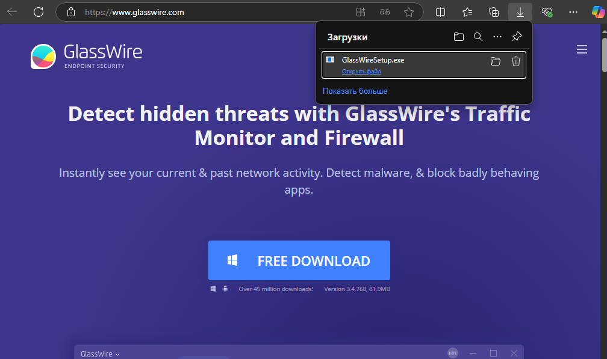
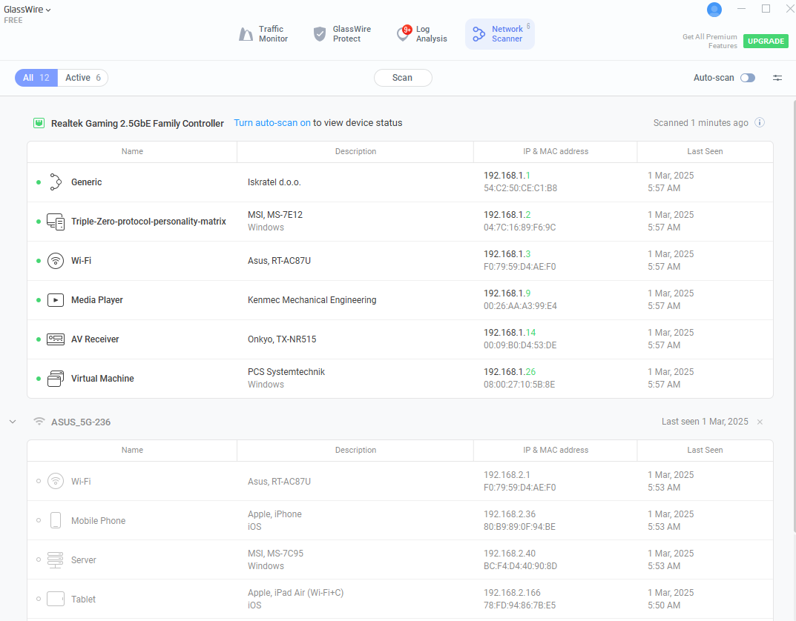
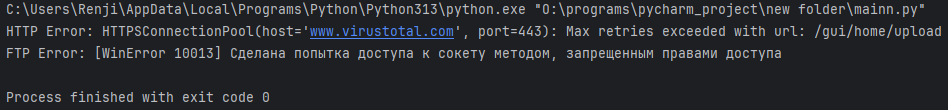

# Антивирусные средства

**Целью работы** является изучение и приобретение навыков работы с программными межсетевыми экранами

## Содержание
- [Антивирусные средства](#антивирусные-средства)
  - [1. Установка Glasswire](#1-установка-glasswire)
  - [2. Изучение и описание настроек межсетевого экрана](#2-изучение-и-описание-настроек-межсетевого-экрана)
    - [2.1 Основный вид брандмауэра "GlassWire защита"](#21-основный-вид-брандмауэра-glasswire-защита)
    - [2.2 Монитор трафика](#22-монитор-трафика)
    - [2.3 Сетевое сканирование](#23-сетевое-сканирование)
    - [2.4 Платные функции безопасности](#24-платные-функции-безопасности)
  - [3. Создание сетевых соединений](#3-создание-сетевых-соединений)
    - [3.1 Создание подключения по FTP с помощью FileZilla](#31-создание-подключения-по-ftp-с-помощью-filezilla)
  - [4. Способы блокировки сетевых соединений](#4-способы-блокировки-сетевых-соединений)
    - [4.1 Блокировка трафика для приложений](#41-блокировка-трафика-для-приложений)
    - [4.2 Блокировка соединений](#42-блокировка-соединений)
      - [4.2.1 Блокировка подключения по протоколу FTP](#421-блокировка-подключения-по-протоколу-ftp)
      - [4.2.2 Блокировка подключения по протоколу RDP](#422-блокировка-подключения-по-протоколу-rdp)
  - [5. Сканирование виртуальной машины с помощью nmap](#5-сканирование-виртуальной-машины-с-помощью-nmap)
  - [6. Реализация соединений на Python](#6-реализация-соединений-на-python)


## Структура проекта
- `main.py` — программная реализация соединений на Python
- `requirements.txt` — список зависимостей
- `images/` — изображения 
- `Антивирусные средства.docx` — работа в виде docx

# 1 Установка Glasswire 




Устанавливаем русский язык в настройках приложения:


# 2 Изучение и описание настроек межсетевого экрана

Изучаем и подробно описываем настройки межсетевого экрана. 
Поварьируем настройки политик, конфигурацию, журналирование и тд:

## 2.1 Основный вид брандмауэра "GlassWire защита"

Основный вид брандмауэра "GlassWire защита" имеет следующий вид:


Здесь отображены приложении, их версии, входящий и исходящий трафик.
Также можно заблокировать подключение определенного приложения к сети:


После настройки:


Также имеется функция оценки безопасности GlassWire:


А также присутствует возможность проверить файл с помощью API
VirusTotal:


Результат:


## 2.2 Монитор трафика

Ещё одна из основных функций – монитор трафика, где с помощью
графика или таблицы можно отобразить активность приложений в сети за
последние 5 минут / 3 часа / 1день:


Например, попробуем подключиться к прокси-серверу через приложение
hiddify, видим в мониторе трафике следующие изменения:


Также попробуем загрузить страницу интернет-ресурса "Яндекс дзен", видим
в мониторе трафике следующие изменения:


## 2.3 Сетевое сканирование

GlassWire также позволяет сделать сетевое сканирование:



Запустим ещё одну виртуальную машину в локальной сети и после ещё одного
сканирования видим ещё одного пользователя:


## 2.4 Платные функции безопасности

Также существует некоторые платные функции безопасности:


На этом возможности бесплатной версии GlassWire заканчиваются. Для
выполнения следующих заданий будем использовать встроенный в
операционную систему Windows Defender Firewall.

# 3 Создание сетевых соединений

Создаём не менее трёх сетевых соединений, помимо существующих
(загрузка через браузер, удаленный доступ, доступ к веб страницам,
доступ по FTP и др.):

## 3.1 Создание подключения по FTP с помощью FileZilla

Скачиваем FileZilla с официального сайта:


Устанавливаем соединение:


Подключаемся к серверу и пробуем передать файлы на виртуальную машину:


# 4 Способы блокировки сетевых соединений

Рассмотрим различные способы блокировки сетевых соединений (по порту,
по приложению и иные) и выполним апробацию блокировки/разрешения
соединений из задания 3:

## 4.1 Блокировка трафика для приложений

Файрволл GlassWire представляет возможность блокировки сетевого
трафика для конкретного приложения:

Блокируем трафик для браузера:


До включения настройки:


После включения настройки:


## 4.2 Блокировка соединений

Приведём примеры заблокированных/разрешенных соединений,
инициированных в задании 3:

### 4.2.1 Блокировка подключения по протоколу FTP 

Заблокируем подключение по FTP. Создаём новое правило, запрещающие
подключение по порту 21:


До включения настройки:


После включения настройки:


### 4.2.2 Блокировка подключения по протоколу RDP

Заблокируем подключение по RDP:


До включения настройки подключаемся через удалённый рабочий стол
(mstsc):


Успешно подключаемся:


После включения правила:


# 5 Сканирование виртуальной машины с помощью nmap 

Разворачиваем вторую виртуальную машину, настраиваем между ними
сеть, выполняем сканирование виртуальной машины с межсетевым экраном при
помощи nmap

Скачиваем программу nmap с официального сайта:


Проверяем подключение между двумя ВМ:


Проводим сканирование с помощью Zenmap и в результате видим 4 открытых
порта:


Теперь включаем ранее подключенное правило "block rdp" и настраиваем
новую блокировку 445 порта:


Проводим снова сканирование с помощью zenmap и теперь не видим закрытые
порты:


# 6 Реализация соединений на Python

Напишем код на python, реализующее некоторые соединения:

```python
import requests
from ftplib import FTP

# 1. HTTP-запрос
def http_request():
    try:
        response = requests.get("https://www.virustotal.com/gui/home/upload")
        print(f"HTTP Status Code: {response.status_code}")
    except Exception as e:
        print(f"HTTP Error: {e}")

# 2. FTP-подключение
def ftp_connect():
    try:
        ftp = FTP("test.rebex.net")
        ftp.login("demo", "password")
        print("FTP Login Successful")
        ftp.quit()
    except Exception as e:
        print(f"FTP Error: {e}")

if __name__ == "__main__":
    http_request()
    ftp_connect()
```

Результат выполнения программы:


Теперь применим правила брандмауэра, заданные заранее:


Выполняем код ещё раз и видим ошибки подключения:


